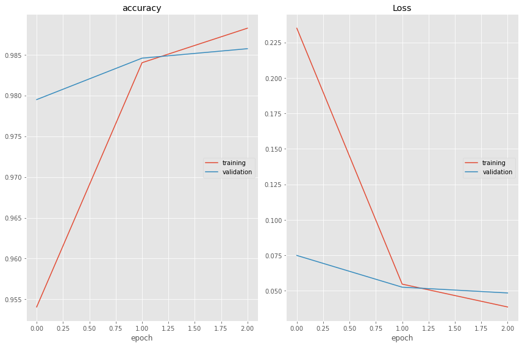

# Named Entity Recognition using Tensorflow and TFX API

Named entity recognition (NER)is a type of information extraction proiblem that helps to identify the named entities in text into pre-defined categories such as the <b>names of persons, organizations, locations, expressions of times, quantities, monetary values, percentages, etc...</b> NER is used in many fields in Natural Language Processing (NLP), and it can help answering many real-world questions, such as:

<ul>In which locations did the disaster happened?
<ul>Were specified products mentioned in complaints or reviews?
<ul>Does the post contain the name of the goverment official?

### Datset
The used contains the sentence as an input and the  tags as labels, The dataset is taken from Kaggle, It is also available in this repo inside data folder

### Approach

The notebook NER.ipynb implements the standard Named Entity Recogntion using Tensorflow, The model architecture uses standard Embedding Layer,GRU Layer,TimeDistributed Layer and SpatialDropout Layer for regularization 
The notebook NER_TFX.ipynb implements the additional TFX API and served a model using Tensorflow-Serve, it is implemented in colab, so if you are re-implementing this in loca, you may need to check the official tensorflow documentation

### Results

### Contributing guidelines
This repository is open to contributions,if you have any issues/want to make a constructive criticism raise an issue in this repo 
Please refer to CONTRIBUTING.MD for further guidelines
### Future Work
<ul>Create a REST API using Flask/FastAPI</ul>
<ul>Add a workflow notebook PR review</ul>